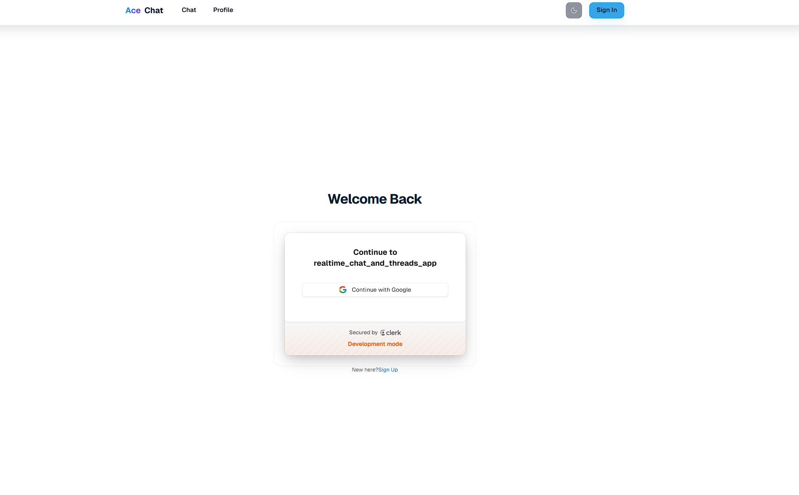
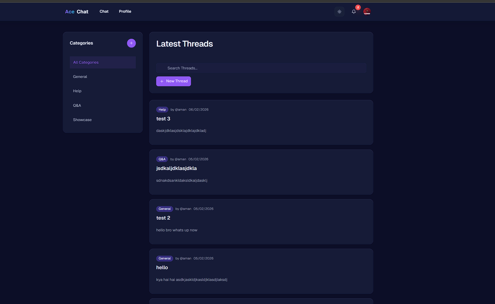
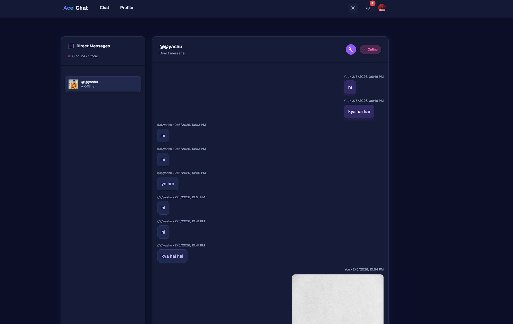
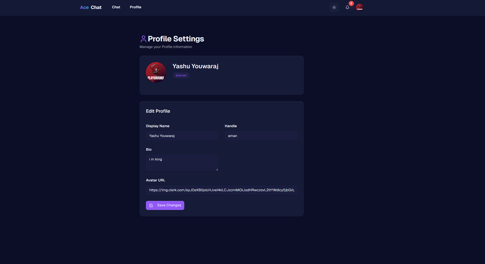

# RealTime Chat App

A full-stack real-time chat application with threads, notifications, and video call support. Built with TypeScript, Socket.io, Redis, and Next.js. The UI features a premium frosted glass theme and responsive chat with lazy-loaded message pagination similar to WhatsApp.

## Features

- Real-time direct messages (Socket.io)
- Message attachments (Cloudinary)
- Threaded conversations and notifications
- Redis adapter for Socket.io (optional)
- PostgreSQL persistence for users/threads/messages
- Premium glassmorphism UI with dark and light (glass) themes
- WhatsApp-like lazy-loaded message pagination
- Video call signaling support

## Screenshots

Below are screenshots of the app (stored in the repository under the `Images/` folder):

- Login page

   

- Home / Threads

   

- Message room / Conversation view

   

- Notifications panel

   

- Profile / Settings

   

## Tech Stack

- Backend: Node.js, Express, TypeScript
- Realtime: Socket.io with optional Redis adapter
- Database: PostgreSQL
- Cache/Adapter: Redis
- File uploads: Cloudinary
- Auth: Clerk (publishable + secret keys)
- Frontend: Next.js (app router), React, TypeScript, Tailwind-like utilities
- Dev tooling: tsx, Turbopack (Next), nx/none
- Containerization: Docker, docker-compose

## Repository Structure

- `backend/` - Express + Socket.io server (TypeScript)
- `frontend/` - Next.js (app router) React client
- `docker-compose.yml` - Postgres + Redis for local development
- `docker-compose.redis.yml` - Alternative Redis compose file

## Environment Variables

Backend (`backend/.env` or system env):

- `PORT` (default `5000`)
- `DB_HOST` (default `localhost`)
- `DB_PORT` (default `6450`)
- `DB_NAME` (default `realtime_chat_and_threads_app`)
- `DB_USER` (default `postgres`)
- `DB_PASSWORD` (default `postgres`)
- `CLERK_PUBLISHABLE_KEY` (required for auth)
- `CLERK_SECRET_KEY` (required for auth)
- `REDIS_HOST` (default `localhost`)
- `REDIS_PORT` (default `6379`)
- `REDIS_PASSWORD` (optional)
- `ENABLE_REDIS_ADAPTER` (`true`/`false`, default `false`)

Frontend (`frontend/.env` or Vercel environment):

- `NEXT_PUBLIC_API_URL` (e.g. `http://localhost:5000`)
- Clerk publishable key / other next-specific env as required

## Local Development (Docker)

1. Start Postgres and Redis with Docker Compose:

```bash
# from repo root
docker compose up -d
# or if you want only redis, use docker-compose.redis.yml
# docker compose -f docker-compose.redis.yml up -d
```

2. Run DB migrations (backend):

```bash
cd backend
# ensure env vars point to dockerized Postgres (DB_HOST=localhost DB_PORT=6450)
npm install
npx tsx src/db/migrate.ts
# or use script: npm run migrate (if configured)
```

3. Start backend (development):

```bash
cd backend
npm install
npm run dev
# server listens on PORT (default 5000)
```

4. Start frontend (development):

```bash
cd frontend
npm install
npm run dev
# Next dev (default port 3000; if taken, Next will find next free port)
```

Visit `http://localhost:3000` (or the port shown in the terminal) and open `/chat`.

## Local Development (without Docker)

- Ensure PostgreSQL and Redis are running locally and update environment variables accordingly.
- Then follow steps 2-4 above.

## Production / Deployment

General guidance:

- Build and deploy the backend as a Docker container (recommended) to cloud providers like Render, Fly.io, or AWS ECS. Ensure environment variables are configured.
- Use managed Postgres (e.g., Render Postgres, AWS RDS) and managed Redis (Redis Cloud, ElastiCache).
- For the frontend, Vercel is recommended for Next.js.

### Deploying Frontend to Vercel

1. Push your `frontend/` directory to your Git provider (GitHub/GitLab).
2. Create a new Vercel project, import the `frontend` repository or monorepo project.
3. Set environment variables in Vercel dashboard:
   - `NEXT_PUBLIC_API_URL` -> URL of your backend (e.g., `https://api.example.com`)
   - Clerk publishable key and any other public envs
4. Vercel will build the project; Next will use the production build pipeline.

Notes when using Docker and Vercel together:

- Vercel only hosts the frontend. Host the backend as a separate service (Docker container).
- Point the `NEXT_PUBLIC_API_URL` to your hosted backend.

### Deploying Backend (Docker example)

- Build image:

```bash
docker build -t my-org/realtime-backend:latest ./backend
```

- Push to container registry (Docker Hub / GitHub Packages / ECR), then run on your host/cloud provider. Provide environment variables and connect to managed Postgres/Redis.

## Troubleshooting & Notes

- If Next dev fails with a Turbopack panic, remove the `.next` directory and restart. Example:

```powershell
Remove-Item -Recurse -Force .next
npm run dev
```

- If you see `EADDRINUSE` on backend port, identify and stop the process occupying the port, or set `PORT` env var to another port.

- For Socket.io Redis adapter, enable `ENABLE_REDIS_ADAPTER=true` and set `REDIS_HOST`/`REDIS_PORT`.

- Clerk authentication requires proper Clerk keys (publishable + secret) in both frontend and backend as configured.

## What I tested

- Confirmed frontend Next dev serves `/chat` (HTTP 200) at the developer machine port.
- Confirmed backend `/health` endpoint responds with `200 {"status":"ok"}`.
- Fixed a TSX parse error in `frontend/src/components/chat/direct-chat-panel.tsx` and reverted unintended animation changes.
- Fixed a persistent ripple dot by scoping the pseudo-element to `:active` and removing the `ripple` class from the send button.
- Updated theme CSS variables so message bubbles are readable in light (glass) theme.

## Next Recommended Steps

- Provide Clerk credentials and test sign-in flows end-to-end.
- Run integration tests if available or create automated E2E tests (Cypress/Playwright) for message flows.
- Configure CI to run `npx tsc --noEmit` and `npm run build` for frontend on PRs.

---

If you want, I can:

- Run an automated smoke script to simulate message flow (requires test users or bypassing Clerk auth).
- Create simple E2E tests.
- Fine-tune light theme bubble colors to specific shades you prefer.

